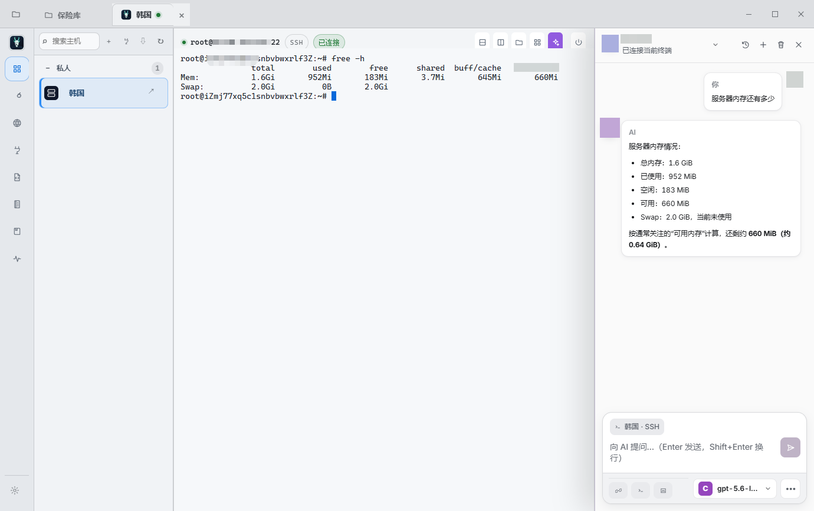

<div align="center">


# Goral（斑羚）

**跨越复杂，稳达每一端。**

没有 Electron 的原生终端工作区：SSH、Telnet、串口、Mosh、Eternal Terminal、
本地 Shell 与 SFTP，全都放进一个窗口。

[](LICENSE)
[](#安装)
[](https://tauri.app)
[](https://www.rust-lang.org)
[](https://nodejs.org)

[English](README.md) · **简体中文**

</div>

<picture>
  <source media="(prefers-color-scheme: dark)" srcset="docs/images/goral-terminal-ai-dark.png">
  <source media="(prefers-color-scheme: light)" srcset="docs/images/goral-terminal-ai-light.png">
  
</picture>

---

## 这是什么

Goral 是给"同时开着一堆连接"的人用的桌面终端客户端。所有协议共用一个窗口，所有主机存在同一个加密保险库里，而特权操作 —— 套接字、PTY、密钥材料 —— 由 Rust 承担，不交给浏览器进程。

“斑羚”能在陡峭、破碎的山地里准确落脚，稳稳穿过看似无路可走的地方。Goral
沿用这层寓意：面对复杂网络、跳板与多种协议，依然可靠地抵达每一个远端。

Goral 派生自 [Netcatty](https://github.com/binaricat/Netcatty)，以 Rust 与 Tauri 2
重写桌面运行时，同时保留熟悉的终端工作流。项目关系与许可证说明见[项目归属](#项目归属)。

**特点**

| | |
|---|---|
| **一个窗口，所有协议** | SSH、Telnet、串口、Mosh、Eternal Terminal 和本地 Shell 都在一个工作区管理，共用主题与一致的操作方式。 |
| **秘密由原生层托管** | 持久化的私钥、口令与 API Key 不进入设置 JSON；已保存值由平台凭据存储保管，也不会回传给渲染进程。 |
| **原生而自足** | 桌面运行时采用 Rust / Tauri，不捆绑 Electron 浏览器；可选的 Mosh 与 Eternal Terminal 客户端由仓库脚本下载并校验。 |
| **权限明确的 AI 助手** | 只有你主动附加时它才读得到终端输出；`observer` 从不执行，`confirm` 会确认确切命令，只有你主动选择 `auto` 后才会自动执行通过原生安全策略的命令。 |

---

## 功能

### 连接

- **SSH** —— 密码、私钥、证书与键盘交互认证；SOCKS/HTTP 代理；有序跳板链；带托管 `known_hosts` 的主机密钥校验。
- **SFTP** —— 浏览、传输、暂停与续传，采用原子化的无覆盖发布。
- **Telnet** —— 身份投影、按主机字符集、本地回显与行模式。
- **串口** —— 完整端口配置、高波特率、字符集，以及可取消的 YMODEM / ZMODEM 流式传输状态机。
- **本地 Shell** —— Windows ConPTY 与 Unix PTY，支持 Shell 发现和按配置的起始目录。
- **Mosh** 与 **Eternal Terminal** —— 基于同一套已保存主机配置的漫游容错会话，使用仓库脚本获取的可选原生客户端。

### 工作区

- 单个全局标签目录最多 64 个并发会话；切换标签不会重新挂载终端，后台输出与回滚缓冲都不会丢。
- SSH / 本地 Shell 实时分屏、可停靠侧边面板、独立设置窗口，以及原生系统托盘。
- 关闭主窗口（包括 `Alt+F4`）时可选择退出、最小化到托盘或取消。左键单击托盘会
  恢复主窗口；托盘菜单可显示或隐藏全部应用窗口、打开设置，或不再二次确认地退出。
- 设置窗口包含应用、外观、终端、SFTP、AI 与系统页面。
- **备注与脚本** —— 运维笔记与可复用片段，可挂到主机上。
- **连接日志** —— 加密的会话录制，支持只读回放与 TXT / RAW / HTML 导出。
- **端口转发** —— 按主机管理本地、远程与动态隧道。
- 新安装默认简体中文，并可立即切换英文。

### AI 助手

一个可选的侧边面板，能读取终端上下文并给出命令建议。

- 支持可配置的 **OpenAI Chat Completions 兼容**端点（内置 13 个预设），以及直连
  **Anthropic Messages**。
- 回复通过可取消的 SSE 通道增量流式输出。
- 三种权限模式：`observer`（从不执行）、`confirm`（每条命令都需对确切文本明确批准）、`auto`（受原生安全策略约束）。
- 终端输出**只有**在你附加时才会发送 —— "加入选中文本"和"加入最近输出"都是显式动作，绝不隐式发生。
- 对话、草稿与附件按终端会话和代次隔离；重连或切换标签都不会把上下文带过去。

---

## 安全模型

这个工具替你保管着重要机器的凭据，所以边界值得说清楚。

- **凭据托管。** 密钥存放在操作系统凭据存储中，账户名同时绑定配置档**和**其规范化端点。已存储的密钥材料不会进入设置 JSON，也不会返回给渲染进程。
- **后端才是权威。** 原生代码以持久化的设置快照为准来判定端点、模型、协议和命令权限，并在原生边界重新校验渲染进程请求。
- **失败即关闭。** 无效的主机密钥状态、悬空的脚本引用和畸形的服务商响应，都会在产生任何副作用之前中止。结构性预检在主密钥或保险库图创建之前就会运行。
- **脱敏。** 后端错误信息与日志会对服务商响应体、密钥材料和主机地址进行脱敏。

发现问题？见 [SECURITY.md](SECURITY.md)。请不要在公开 issue 里附上密钥、主机地址或日志正文。

---

## 安装

本仓库不提供官方预编译程序。你可以按下文说明从源码运行 Goral。

Windows 便携版直接运行 `Goral.exe`。它无需安装程序，也不会写入由安装器管理的
注册表项；应用数据保存在标准的用户级应用目录中。

```
Goral.exe        应用程序
et/                  Eternal Terminal 客户端（可选）
mosh/                Mosh 客户端（可选）
MANIFEST.json        每个随包文件的 SHA-256
```

运行前先校验你下载到的东西：

```powershell
Get-FileHash .\Goral.exe -Algorithm SHA256
```

然后与同一份 Goral 构建随附的 `MANIFEST.json` 比对。

---

## 从源码构建

**前置条件** —— [Rust](https://rustup.rs) 1.88+、[Node.js](https://nodejs.org) 22+，以及你所在平台的 [Tauri 2 系统依赖](https://tauri.app/start/prerequisites/)。在 Windows 上即 WebView2 运行时与 MSVC 构建工具。

在 Windows PowerShell 中：

```powershell
git clone https://github.com/749755576/goral.git
cd goral
npm.cmd ci
npm.cmd run fetch:native-clients  # 下载锁定的 Mosh / ET 客户端并校验 SHA-256

npm.cmd run tauri:dev               # 带热重载运行桌面应用
```

原生客户端可执行文件不会存入 Git，因此全新克隆后必须先执行下载步骤，再运行
`tauri:dev`、`tauri:build` 或 `package:portable`；仓库脚本锁定并校验其版本、来源和哈希。

### 验证

```powershell
cargo fmt --all -- --check
cargo test --workspace
npm.cmd run test:frontend
npm.cmd run build
```

### 发布构建

```powershell
npm.cmd run package:portable     # → output/portable/windows-x64/
```

这是唯一受支持的发布入口；它在发布便携目录之前总会先执行一次正式的 `tauri build`。

> 在可执行文件名为 `npm` 的其他 Shell 中使用对应的 `npm` 命令即可。打包步骤会重命名
> 输出目录，所以请先关闭此前启动的打包版可执行文件。

---

## 架构

Rust 后端与 React/xterm.js 渲染器通过类型化命令通信。crate 不依赖前端，核心 crate 也不依赖 Tauri。

```
crates/
├── netcatty-core            共享原语与应用无关的模型
├── netcatty-ssh             SSH 配置、认证规划、会话与传输
├── netcatty-telnet          Telnet 运行时与身份投影
├── netcatty-serial          串口传输、YMODEM / ZMODEM 状态机
├── netcatty-local-pty       ConPTY 与 Unix PTY 生命周期
├── netcatty-mosh            Mosh 引导与会话管理
├── netcatty-et              Eternal Terminal 集成
├── netcatty-vault           带版本的主机 / 凭据图
├── netcatty-secret-store    操作系统凭据存储托管
├── netcatty-credentials     凭据解析与投影
├── netcatty-replay-store    加密会话录制
├── netcatty-log-export      TXT / RAW / HTML 导出
├── netcatty-migration       旧版保险库导入
├── netcatty-ai              服务商传输、SSE 流式、工具策略
└── netcatty-sysmanager      有界远程系统命令规划与解析器

src-tauri/                   桌面生命周期与渲染器/原生层集成
src/                         React 界面、xterm.js 与类型化后端客户端
```

界面使用统一的设计令牌，并支持浅色与深色两种主题。

更深入的说明见 [docs/ARCHITECTURE.md](docs/ARCHITECTURE.md)。

---

## 项目归属

Goral 是派生自 GPL 授权的 [binaricat/Netcatty](https://github.com/binaricat/Netcatty)
项目、完全移除 Electron 的 Rust / Tauri 重构。它**不是** Netcatty 官方发行版，也未获
上游作者赞助、认可或背书。项目保留 GPL 来源、上游版权归属与适用的第三方声明，同时
使用独立的产品身份和桌面运行时。

见 [NOTICE.md](NOTICE.md)、[SOURCE.md](SOURCE.md) 与 [THIRD_PARTY_NOTICES.md](THIRD_PARTY_NOTICES.md)。

---

## 参与贡献

请先阅读 [CONTRIBUTING.md](CONTRIBUTING.md) 与[架构说明](docs/ARCHITECTURE.md)。行为变更需要 Rust 单元测试；跨越 Tauri 边界的改动还需要集成测试或前端契约测试。

参与本项目即表示你同意遵守[行为准则](CODE_OF_CONDUCT.md)。

---

## 许可证

[GPL-3.0-or-later](LICENSE)。版权所有 © 749755576 与贡献者。
